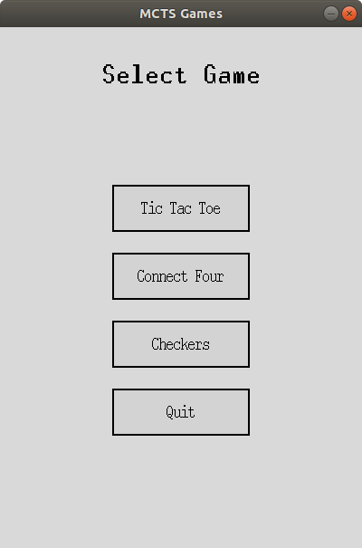
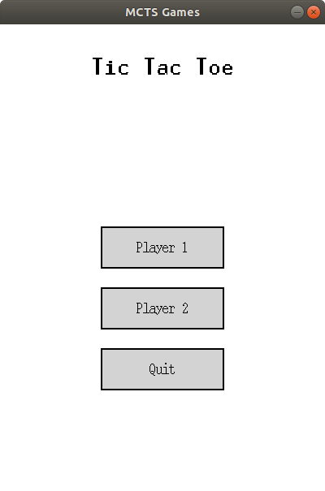
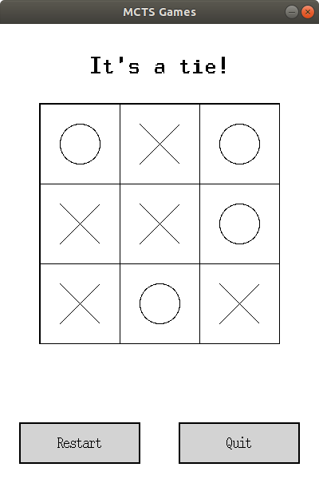
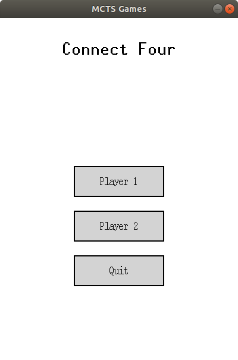
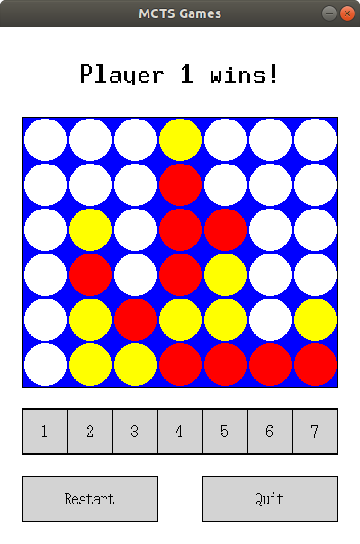
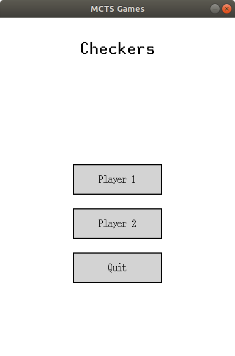

# mcts
Monte Carlo tree search applied to several games.

## Installation
Install by cloning the repository with

    git clone https://github.com/GautamGopalKrishnan/mcts.git

and building with

    python setup.py build_ext -i

## Playing a Game
Run the main application with

    python run.py

which will prompt you to select a game and choose a player.

## Tic-Tac-Toe
Select player from the menu and click on the box where you want to make your move.

## Connect Four 
Select player from the menu and click on the column number where you want to make your move.

## Checkers
Select player from the menu.

Click on the piece you want to move and then click the square where you want the piece to move to.

## Running Tests
Basic checks of the package are performed with

    python -m pytest

## Building Documentation

Documentation is built with Sphinx. To rebuild, run

    sphinx-apidoc -f -o source/ ../mcts/
    make html

in the `docs/` directory. Then view the output with

    open build/html/index.html
