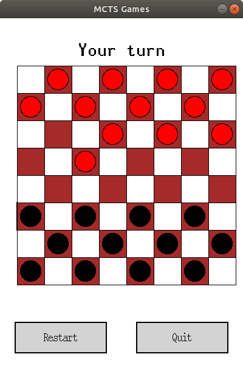

# mcts
Monte Carlo tree search applied to several games.

This project has a python implementation of Monte Carlo tree search applied to Tic-Tac-Toe, Connect Four and Checkers which was later wrapped with a cython implementation to improve performance (by a factor of 10).

- Tree policy at selection step has an epsilon-greedy implementation (with epsilon = 0.05) and an upper confidence bound (UCB) implementation (with c=sqrt(2))
- Number of rollouts performed is limited by the timeout value which is set to a default of 1.0 second
- Values at each node of game tree stores average expected reward based on Monte Carlo prediction

You can find below the instructions (with images) to install and run the games.

## Installation
Install by cloning the repository with

    git clone https://github.com/GautamGopalKrishnan/mcts.git

and building with

    python setup.py build_ext -i

## Playing a Game
Run the main application with

    python run.py

which will prompt you to select a game and choose a player.

## Tic-Tac-Toe
Select player from the menu and click on the box where you want to make your move.

## Connect Four 
Select player from the menu and click on the column number where you want to make your move.

## Checkers
Select player from the menu.

Click on the piece you want to move and then click the square where you want the piece to move to.

## Running Tests
Basic checks of the package are performed with

    python -m pytest

## Building Documentation

Documentation is built with Sphinx. To rebuild, run

    sphinx-apidoc -f -o source/ ../mcts/
    make html

in the `docs/` directory. Then view the output with

    open build/html/index.html
